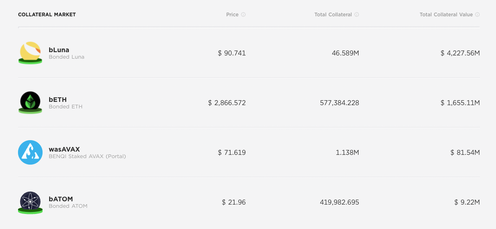

# 📌 자신이 원하는 사이트 레이아웃 클론

- 과제 기한:
  - 과제 수행 기간: 2022년 04월 14일(목) 19시 ~ 2022년 04월 28일(목) 19시
  - 코드 리뷰 기간: 2022년 04월 28일(목) 19시 ~ 2022년 05월 06일(금) 19시
- 내용:
  - 원하는 사이트(페이지)를 자유롭게 선택하고 레이아웃을 클론 코딩하세요.
  - 평소에 도전해 보고 싶었거나 혹은 자신의 수준에 맞는 사이트(페이지)를 선택하세요.

## 필수 요구사항

- [x] 정리된 README.md 파일을 제공하세요!
- [x] 결과와 비교할 수 있는 선택 사이트의 주소를 명시하세요!
- [x] 제출 프로젝트에 확인 가능한 HTML, CSS 파일이 모두 있어야 합니다!
- [x] 브라우저에서 정상적으로 출력돼야 합니다!

## 선택 요구사항

- [x] 시멘틱 태그를 최대한 활용해보세요.
- [ ] 레거시 코드 활용보단 최신의 CSS Flex와 Grid를 활용해보세요.
- [ ] JS가 필요한 부분은 생략하고 이유를 명시해보세요.(CSS로 대체 가능한지 피드백이 있을 수 있겠죠?!)
- [ ] JS가 필요한 부분 중 구현할 부분이 있다면 자유롭게 구현해보세요.
- [ ] SCSS를 도입해보세요.
- [ ] SCSS 컴파일에 Webpack이나 Parcel 같은 번들러를 활용해보세요.
- [x] BEM 방법론을 도입해보세요.

# HTML/CSS 레이아웃 클론과제
## 웹사이트
> [Anchor Protocol](https://app.anchorprotocol.com/)
* crypto에서 대표 L1 체인중 하나인 LUNA의 가장 성공한 프로젝트입니다.

## 선정한 이유 
* css 레이아웃 구조가 모두 포함되어 있습니다.
  - grid, table, flex 등
* css과 html에 집중해서 구현해보고 싶었습니다.

## 어려웠던 점들

### grid
* gird를 쓴 부분을 저는 flex로 구현했었는데 왜 grid로 구현했는지 직접해보면서 느꼈습니다.

  - 사진과 같이 숫자의 길이가 다른 요소들을 나타낼 때는 grid를 통해서 자리를 잡아주는 것이 더 깔끔했습니다.

  - flex로 하니 글자길이에 따라 요소 너비가 달라져 수평 정렬이 어려웠습니다. 결국 너비길이를 지정하는 쪽으로 해결했는데 좋은 방법은 아닌 것 같습니다..

### @media
* 미디어 쿼리를 레이아웃 다 만들고 적용하려고 했습니다.

* 나중에 적용하려고 보니 전체 틀이 다 깨지고 section 마다 구조 짜는 방식이 조금씩 달랐습니다.

* 결국 반응형을 만드려면 처음부터 모든 것을 수정해야해서 적용하지 못했습니다.

## 느낀점
* 혼자 처음부터 끝까지 만들면서 막히는 부분이 많았고 그래도 어떻게든 방법을 찾으면서 주먹구구식으로 만든 것 같습니다.

* 거의 흉내내는 식으로 만들었지만 코드는 깔끔하지 못했던 것 같습니다.

* 처음 클론 해보기 때문에 전체 틀을 생각하지 않았던 것 같습니다.

* 이것 또한 시행착오라 생각하고 다음엔 더 나은 프로젝트를 만들었으면 좋겠습니다!